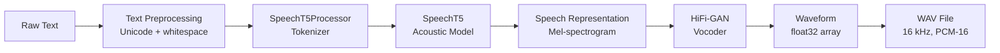
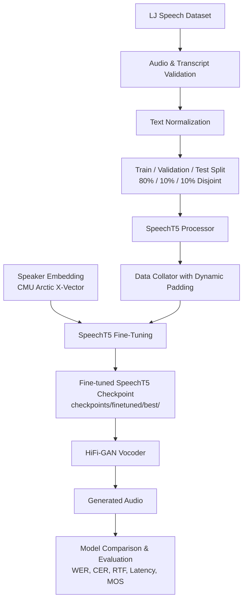

# TTS Baseline

> **Stage 1** — Pretrained Transformer TTS inference baseline using  
> SpeechT5 (Microsoft) + HiFi-GAN vocoder

---

## Problem Statement

Building a production voice-agent requires a TTS engine that is fast,
reliable, and measurably correct.  Before optimizing, you need a clean
baseline: a reproducible, instrument-everything starting point that
isolates the model's raw latency and audio quality so subsequent
optimizations can be fairly compared.

## Motivation

This project establishes Stage 1 of a multi-stage TTS development
pipeline.  The goals are:

1. Produce intelligible speech from raw text using a pretrained model.
2. Measure preprocessing, acoustic-model, and vocoder latency **separately**.
3. Calculate the Real-Time Factor (RTF) for every generated sample.
4. Expose the pipeline through a FastAPI endpoint ready for integration.
5. Provide a clean codebase that a reviewer can audit in under an hour.

---

## Architecture



### Acoustic model vs vocoder

| Component | Role | Model |
|-----------|------|-------|
| **SpeechT5** (acoustic) | Converts tokenized text + speaker embedding → mel-spectrogram-like representation | `microsoft/speecht5_tts` |
| **HiFi-GAN** (vocoder) | Converts the acoustic representation → raw audio waveform | `microsoft/speecht5_hifigan` |

The two stages are kept logically separate in `src/model.py` so that
either can be swapped or optimized independently.

---

## Installation

```bash
# 1. Clone the repository
git clone https://github.com/your-org/tts-baseline.git
cd tts-baseline

# 2. Create a virtual environment
python -m venv .venv
source .venv/bin/activate   # Windows: .venv\Scripts\activate

# 3. Install dependencies
pip install -r requirements.txt
```

> **GPU users:** ensure a CUDA-compatible PyTorch is installed.
> See https://pytorch.org/get-started/locally/ for the correct index URL.

Model weights (~500 MB) are downloaded automatically from Hugging Face
on first use.  Set `HF_HOME` to control the cache directory.

---

## Usage

### Single-sentence synthesis

```bash
python scripts/synthesize.py --text "Hello, how can I help you today?"
```

Sample output:

```
──────────────────────────────────────────────────
  TTS BASELINE
──────────────────────────────────────────────────
  Text:            'Hello, how can I help you today?'
  Device:          CUDA
  Audio duration:  2.14 s
  Inference time:  0.83 s
  RTF:             0.388
  Output:          outputs/audio/0001_hello_how_can_i_help.wav
──────────────────────────────────────────────────
```

### Batch synthesis (full test corpus)

```bash
python scripts/synthesize.py --input_file data/input/test_sentences.txt
```

### Save spectrograms alongside audio

```bash
python scripts/synthesize.py --text "Your order is confirmed." --save_spectrograms
```

Outputs `outputs/spectrograms/<stem>_waveform.png` and
`outputs/spectrograms/<stem>_mel_spectrogram.png`.

---

## Benchmarking

```bash
# Default device (auto-selects CUDA if available)
python scripts/benchmark.py

# Force CPU
python scripts/benchmark.py --device cpu

# Force GPU
python scripts/benchmark.py --device cuda
```

Outputs:
- `outputs/reports/baseline_results.csv` — per-sample rows
- `outputs/reports/benchmark_summary.csv` — aggregated statistics
- Human-readable summary printed to stdout

---

## Evaluation

```bash
# Latency + RTF only
python scripts/evaluate.py

# With ASR-based WER (requires additional download of whisper-base)
python scripts/evaluate.py --enable_asr
```

Output: `outputs/reports/evaluation_report.csv`

---

## API

### Launch

```bash
uvicorn api.main:app --host 0.0.0.0 --port 8000
```

The model is loaded **once** at startup.  A warm-up inference runs
automatically before the server accepts requests.

### Endpoints

#### `POST /synthesize`

```bash
curl -X POST http://localhost:8000/synthesize \
     -H "Content-Type: application/json" \
     -d '{"text": "Your order has been shipped."}' \
     --output synthesized.wav
```

Returns WAV audio (`audio/wav`).

#### `GET /health`

```bash
curl http://localhost:8000/health
```

```json
{
  "status": "healthy",
  "model_loaded": true,
  "device": "cpu"
}
```

#### `GET /metrics`

```bash
curl http://localhost:8000/metrics
```

```json
{
  "request_count": 10,
  "error_count": 0,
  "total_audio_seconds": 24.3,
  "total_inference_seconds": 9.1,
  "latency": {
    "mean_s": 0.91,
    "p50_s": 0.87,
    "p95_s": 1.12,
    "min_s": 0.74,
    "max_s": 1.23
  },
  "device": "cpu"
}
```

---

## Evaluation Methodology

### Latency measurement

All timings use `time.perf_counter()` (high-resolution monotonic clock).
Three stages are measured separately:

| Stage | What is measured |
|-------|-----------------|
| Preprocessing | Unicode normalization + whitespace collapse |
| Acoustic model | `generate_speech()` call (includes vocoder when fused) |
| Vocoder | Separate if the two stages are decoupled; 0.0 when fused |

**CUDA synchronization:** when the device is CUDA,
`torch.cuda.synchronize()` is called before stopping the timer so that
GPU kernel completion is included in the measurement.

Model download and initialization time are **never** included in
inference latency.

### Real-Time Factor (RTF)

```
RTF = total_inference_time (s) / generated_audio_duration (s)
```

A RTF < 1 means the model generates speech faster than real time.
Lower is better.  RTF is computed and stored for every sample.

### ASR-based WER (optional)

```
Input Text → TTS → Generated Audio → Whisper ASR → Transcript → WER
```

WER (Word Error Rate) measures whether the generated speech preserves
recognizable linguistic content and intelligibility.

**WER is NOT a complete measure of TTS naturalness or subjective speech
quality.**  A low WER means the words are intelligible; it does not
measure prosody, naturalness, or pleasantness.  Use MOS (Mean Opinion
Score) studies for perceptual quality evaluation.

---

## CPU vs GPU Baseline Benchmarking

Run the benchmark twice — once per device — and compare the resulting
CSV summaries:

```bash
python scripts/benchmark.py --device cpu
python scripts/benchmark.py --device cuda
```

The model is unmodified between runs; this is a pure baseline
measurement with no optimization applied.

---

## Spectrogram Visualization

Generated automatically when `--save_spectrograms` is passed to
`scripts/synthesize.py`, or when `evaluation.save_spectrograms: true`
in `configs/config.yaml`.

Two PNG files are saved per sample under `outputs/spectrograms/`:

- `<stem>_waveform.png` — time-domain amplitude plot
- `<stem>_mel_spectrogram.png` — 80-band mel spectrogram (magma colormap)

Visualization code lives in `src/visualization.py` and is reusable
independently of the synthesis pipeline.

---

## Running Tests

```bash
pytest tests/ -v
```

Tests do **not** require a GPU or model download.  The `TTSModel` is
mocked in `tests/test_synthesis.py` so the full synthesis pipeline is
tested at unit-test speed.

---

## Limitations

- **Single speaker only** — Stage 1 uses one fixed speaker embedding.
- **Max input length** — SpeechT5 tokenizer handles up to ~600 chars
  reliably; longer texts require chunking (not implemented here).
- **English only** — SpeechT5 is trained on English data.
- **No streaming** — the entire waveform is generated before playback
  begins; latency scales with utterance length.
---

## Stage 2 — Fine-Tuning & Domain Adaptation

Stage 2 adds the complete machine learning training and domain adaptation layer on top of the Stage 1 baseline, fine-tuning SpeechT5 on the single-speaker **LJ Speech** dataset.

### Stage 2 Architecture



### Key Capabilities in Stage 2

1. **Deterministic & Disjoint Dataset Splitting**:
   - Computes an $80\%$ Train / $10\%$ Validation / $10\%$ Test partition with fixed seed (`seed=42`).
   - Strictly verifies $\text{Train} \cap \text{Val} \cap \text{Test} = \emptyset$ to prevent data leakage.
   - Generates `outputs/reports/dataset_statistics.csv`, `dataset_summary.json`, and `dataset_errors.csv`.

2. **SpeechT5 Conditioning & Dynamic Collator**:
   - Batches variable-length tokenized text `input_ids` and target log-mel spectrogram `labels`.
   - Masks padded frames with `-100.0` for loss computation.
   - Conditions the autoregressive acoustic model with a consistent single-speaker 512-dim x-vector.

3. **Training Engine & Checkpointing**:
   - Optimizer: `AdamW` with linear warmup and decay.
   - Gradient accumulation (`effective_batch_size = batch_size * gradient_accumulation_steps`).
   - Mixed precision (FP16) with automatic CPU fallback.
   - Saves intermediate checkpoints and maintains `checkpoints/finetuned/best/` selected exclusively by validation loss.
   - Early stopping triggers after `patience` evaluation intervals without improvement.

4. **Comparative Evaluation & Error Analysis**:
   - Dual-model inference CLI: `--model baseline` vs `--model finetuned`.
   - Character Error Rate (CER) and Word Error Rate (WER) via Whisper ASR.
   - Automated generation of `outputs/reports/model_comparison.csv` and `outputs/reports/human_evaluation_template.csv`.
   - Detailed linguistic breakdown in `experiments/finetuning/error_analysis.md`.

---

## Stage 2 Commands

### 1. Dataset Preparation & Quality Validation
```bash
# Ingest LJ Speech, clean transcripts, validate audio, and create 80/10/10 splits:
python scripts/prepare_dataset.py --config configs/finetune.yaml

# Fast smoke-test (generates synthetic samples offline):
python scripts/prepare_dataset.py --config configs/finetune.yaml --smoke-test
```

### 2. Fine-Tuning SpeechT5
```bash
# Launch fine-tuning with early stopping and experiment logging:
python scripts/train.py --config configs/finetune.yaml

# Rapid dry-run (e.g. 5 steps):
python scripts/train.py --config configs/finetune.yaml --smoke-test --max-steps 5
```

### 3. Dual-Model Synthesis
```bash
# Synthesize using Stage 1 pretrained baseline:
python scripts/synthesize.py --model baseline --text "Speech synthesis technology has advanced dramatically."

# Synthesize using Stage 2 fine-tuned model:
python scripts/synthesize.py --model finetuned --text "Speech synthesis technology has advanced dramatically."
```

### 4. Baseline vs Fine-Tuned Model Comparison
```bash
# Evaluate both models on the held-out test split (latency, RTF, WER, CER):
python scripts/compare_models.py --config configs/finetune.yaml
```

### 5. Running the Test Suite
```bash
pytest tests/ -v
```

---

## Stage 2 Limitations

- **Single Speaker Only**: LJ Speech is a single-speaker English corpus.
- **Dependency on Quality**: Fine-tuning fidelity directly reflects audio recording conditions.
- **ASR Metric Scope**: WER and CER quantify linguistic intelligibility, not subjective warmth or naturalness.
- **No Latency Optimization in Stage 2**: ONNX, INT8 quantization, pruning, and streaming are reserved for Stage 3.

---

## Project Structure

```
tts-baseline/
├── README.md
├── requirements.txt
├── configs/
│   ├── config.yaml             # Stage 1 baseline configuration
│   └── finetune.yaml           # Stage 2 fine-tuning hyperparameters & paths
├── src/
│   ├── config.py               # YAML config loader
│   ├── preprocessing.py        # Text normalization
│   ├── model.py                # SpeechT5 wrapper (baseline & finetuned checkpoint loading)
│   ├── synthesizer.py          # End-to-end inference pipeline
│   ├── dataset.py              # Dataset ingestion, audio validation & deterministic splits
│   ├── collator.py             # SpeechT5 dynamic batch collator & speaker conditioning
│   ├── trainer.py              # Training loop, optimizer, validation & early stopping
│   ├── evaluation.py           # CER computation & human evaluation template generator
│   ├── audio_utils.py          # Audio I/O and validation
│   ├── metrics.py              # RTF, latency and WER statistics
│   ├── visualization.py        # Spectrogram and waveform plotting
│   └── utils.py                # Logging and random seeding
├── scripts/
│   ├── prepare_dataset.py      # Ingest, validate & split dataset
│   ├── train.py                # Launch fine-tuning training loop
│   ├── synthesize.py           # CLI single/batch synthesis (--model baseline|finetuned)
│   ├── compare_models.py       # Comparative evaluation on held-out test set
│   ├── benchmark.py            # Latency benchmark runner
│   └── evaluate.py             # ASR-based evaluation
├── checkpoints/
│   ├── baseline/               # Reference baseline model metadata
│   └── finetuned/              # Fine-tuned step checkpoints and best/ directory
├── experiments/
│   ├── baseline/               # Baseline experiment records
│   └── finetuning/             # Fine-tuning logs and error_analysis.md
├── data/
│   ├── input/                  # Test sentences
│   ├── raw/                    # Raw audio recordings & metadata
│   └── splits/                 # train.json, val.json, test.json (disjoint)
├── outputs/
│   ├── audio/                  # Generated WAV files
│   ├── spectrograms/           # Generated visual plots
│   └── reports/                # CSV/JSON dataset, training, and comparison metrics
└── tests/
    ├── test_preprocessing.py
    ├── test_audio.py
    ├── test_synthesis.py
    ├── test_dataset.py
    ├── test_collator.py
    ├── test_trainer_config.py
    └── test_evaluation.py
```

---

## License

MIT

